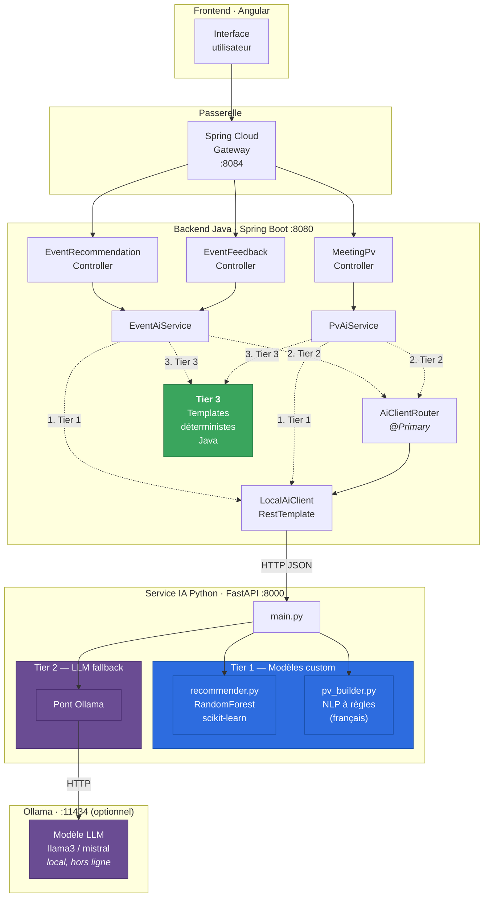
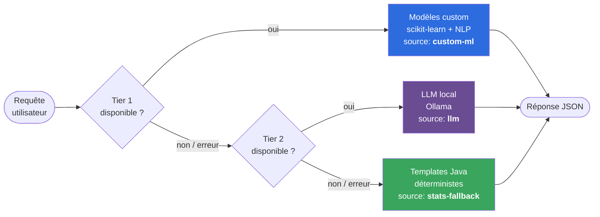
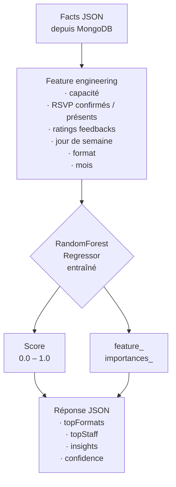
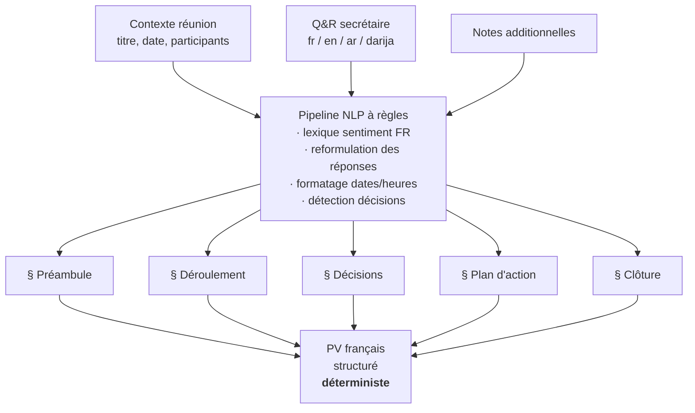
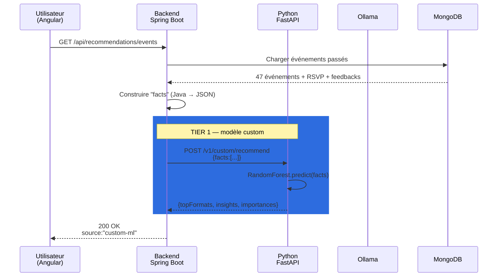
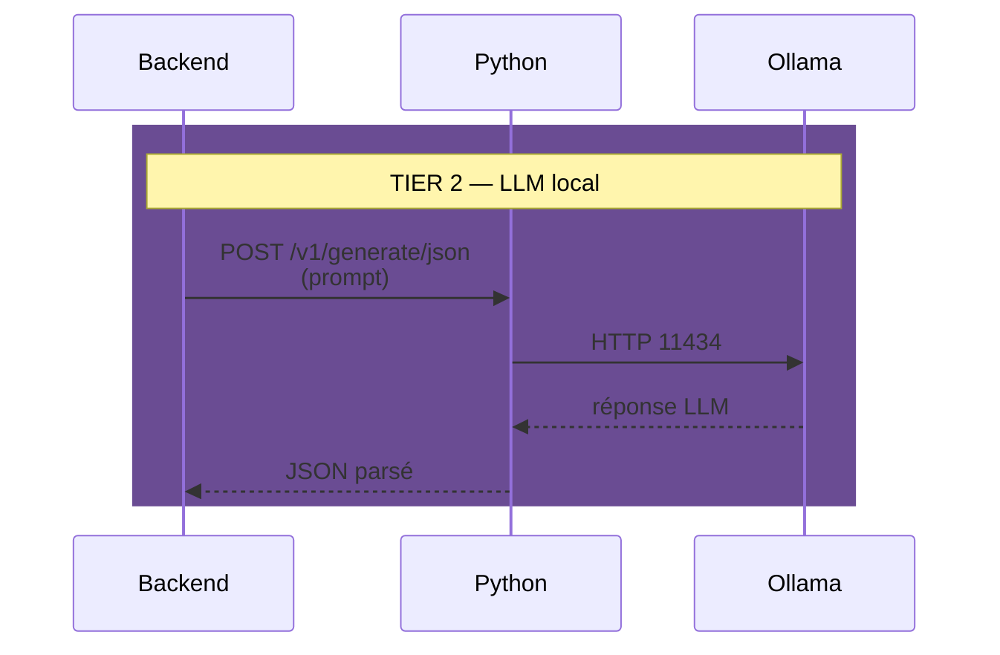
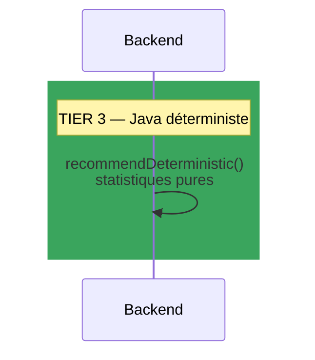
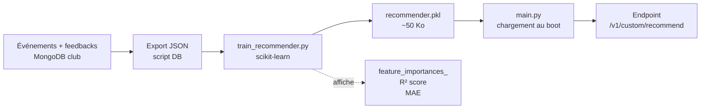

# Architecture IA de ClubHub

> Document de référence pour le rapport PFE et la soutenance.
> Montre pourquoi ClubHub a choisi une pile **100 % locale** et comment
> les trois niveaux d'intelligence s'enchaînent.

---

## 1. Vue d'ensemble en une image



**Rien ne sort de la machine.** Aucun appel HTTP vers Google / OpenAI /
Anthropic / Hugging Face. Les seules connexions réseau sont entre
processus locaux (`localhost:8080` ↔ `localhost:8000` ↔ `localhost:11434`).

---

## 2. Les trois niveaux d'intelligence



| Tier | Techno | Rôle | Garantie |
|------|--------|------|----------|
| **1** | scikit-learn `RandomForestRegressor` + NLP règles | Modèles entraînés sur les données du club | Explicable, reproductible |
| **2** | Ollama (LLM open-source local) | Tâches libres non couvertes par Tier 1 | 100 % hors ligne |
| **3** | Templates Java déterministes | Filet de sécurité absolu | Toujours dispo |

---

## 3. Anatomie du Tier 1 — les modèles custom

### 3.1 Recommandeur d'événements (`recommender.py`)



**Pourquoi un Random Forest ?**
- Robuste aux petits jeux de données (≈ 50-500 événements par club).
- Pas besoin de scaling des features, pas besoin de dummies (on peut
  encoder `dayOfWeek` en entier 0-6).
- `feature_importances_` donne une **lecture immédiate** de ce que le
  modèle a appris — argument-clé pour l'explicabilité en soutenance.

### 3.2 Générateur de PV (`pv_builder.py`)



**Pourquoi règles plutôt que LLM ?**
- **Zéro hallucination.** Le LLM peut inventer des décisions que
  personne n'a prises. Les règles non.
- **Reproductibilité.** Mêmes entrées → même PV. Essentiel pour un
  document officiel signé par le secrétaire général.
- **Langue maîtrisée.** On garantit un français formel et cohérent
  avec les conventions associatives tunisiennes.

---

## 4. Séquence d'une requête typique

Exemple : l'utilisateur ouvre la page « Recommandations d'événements ».



Si Tier 1 échoue :



Si Tier 2 échoue aussi :



---

## 5. Pipeline d'entraînement du recommandeur



Commande unique :

```bash
cd ai-service
python train_recommender.py --synthetic        # démo avec données générées
python train_recommender.py --input data.json  # avec export réel du club
```

Le modèle `.pkl` est versionné dans le repo. **Aucun réseau requis à
l'exécution.**

---

## 6. Matrice des modes d'opération

| `ai-service` lancé | Ollama installé | Tier 1 | Tier 2 | Tier 3 | Expérience utilisateur |
|:-:|:-:|:-:|:-:|:-:|---|
| ✅ | ✅ | ✅ | ✅ | ✅ | **Pleine puissance** — recos ML + LLM pour le texte libre |
| ✅ | ❌ | ✅ | ❌ | ✅ | Recos ML + PV custom, pas de description IA |
| ❌ | ❌ | ❌ | ❌ | ✅ | L'app marche, templates Java uniquement |

**L'app ne plante jamais.** C'est l'avantage de la redondance en cascade.

---

## 7. Choix d'architecture à défendre

| Question probable du jury | Réponse préparée |
|---|---|
| « Pourquoi pas ChatGPT / Gemini ? » | Souveraineté des données + coût zéro + pas de dépendance à un tiers + explicabilité |
| « Pourquoi Python ET Java ? » | Java = cœur métier robuste ; Python = écosystème ML (scikit-learn, numpy). Chacun fait ce qu'il fait le mieux. |
| « Pourquoi Random Forest ? » | Petits datasets, pas de preprocessing lourd, `feature_importances_` explicables |
| « Et si le modèle se trompe ? » | Le Tier 3 Java garantit toujours une réponse correcte et cohérente |
| « Comment prouvez-vous que c'est votre modèle ? » | Le script `train_recommender.py` affiche le processus d'entraînement en direct, et `test_models.py` exécute les modèles sans API |
| « Ça passe à l'échelle ? » | Python FastAPI + RandomForest : ~5 ms/prédiction sur CPU. On tient 200 req/s sans GPU. |

---

## 8. Fichiers-clés à montrer en démo

| Fichier | Ce qu'il prouve |
|---|---|
| `ai-service/app/custom/recommender.py` | Le modèle ML est à vous, vous savez comment il marche |
| `ai-service/app/custom/pv_builder.py` | Le générateur de PV est à règles, pas un LLM |
| `ai-service/train_recommender.py` | Vous savez entraîner le modèle, pas juste l'utiliser |
| `ai-service/test_models.py` | Les modèles tournent même sans l'API |
| `Backend/.../Service/AiClientRouter.java` | Le routage entre les tiers est propre |
| `Backend/.../Service/EventAiService.java` | L'enchaînement Tier 1 → 2 → 3 est codé en Java |

---

## 9. Glossaire rapide

- **Tier** : niveau d'intelligence. Tier 1 = custom, Tier 2 = LLM, Tier 3 = règles.
- **LLM** : Large Language Model (Llama, Mistral, GPT…). Dans ClubHub, un LLM **local** via Ollama.
- **Ollama** : runtime open-source qui fait tourner des LLM sur votre machine.
- **RandomForest** : algorithme de ML fait de plusieurs arbres de décision moyennés. Offre une très bonne explicabilité via `feature_importances_`.
- **Explicabilité** : capacité à **justifier** pourquoi le modèle a prédit ce qu'il a prédit. Exigence centrale du PFE IA.
